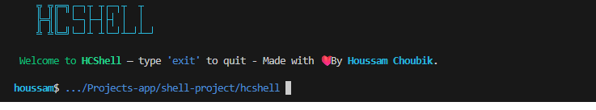

<p align="center">
	<a href="https://www.rust-lang.org"></a>
	<a href="https://crates.io/crates/rustyline"></a>
</p>

HCShell is a tiny Rust-based interactive shell focused on simplicity and a friendly prompt.

> **Version:** v0.1.0 — First public version

Key features
- Executes external commands and supports simple pipelines
- Friendly colored ASCII banner and prompt (username$ /path)
- Cross-platform history file handling
- Uses `rustyline` for line editing and history

## HCShell
<p align="center">
	
</p>

_HCShell running with the colored banner and the `username$ /path` prompt._

Requirements
- Rust toolchain (rustup + cargo)
- On Linux/WSL: a C toolchain (e.g. build-essential) may be required for some crates

Quick start (WSL / Linux)

Build & run (debug):

```bash
cargo build
./target/debug/hcshell
```

Build & run (release):

```bash
cargo build --release
./target/release/hcshell
```

Run without cargo

```bash
./target/debug/hcshell        # debug build
./target/release/hcshell      # release build
```

Install (user-local)

```bash
cargo build --release
mkdir -p ~/.local/bin
cp target/release/hcshell ~/.local/bin/
# Ensure ~/.local/bin is in your PATH (add to ~/.profile or ~/.bashrc):
# echo 'export PATH="$HOME/.local/bin:$PATH"' >> ~/.profile
```

Install via cargo

```bash
cargo install --path .
```

Run on Windows (native)

Build on Windows (PowerShell):

```powershell
cargo build --release
.\target\release\hcshell.exe
```

Or run the Linux build inside WSL from PowerShell:

```powershell
wsl bash -lc 'cd /mnt/c/Users/HoussamClap/Documents/Projects-app/shell-project/hcshell && ./target/debug/hcshell'
```

Cross-compiling to Windows

```bash
rustup target add x86_64-pc-windows-gnu
cargo build --release --target x86_64-pc-windows-gnu
```

Configuration & notes

- History: stored at `$HOME/.hcshell_history` on Unix-like systems, `%USERPROFILE%\\.hcshell_history` on Windows; falls back to the OS temp directory when needed.
- Prompt: shows `username$ /short/path`. It shortens home to `~` and compresses long paths to show trailing components.
- Colors: implemented via ANSI escape codes; use a terminal that supports ANSI (Windows Terminal, PowerShell 7+, WSL terminals).

---

<p align="center">
	<strong>Made with ❤️ by <em>Choubik Houssam</em></strong>
</p>

<p align="center"><em>This is the first version of HCShell — feedback and contributions are welcome!</em></p>
